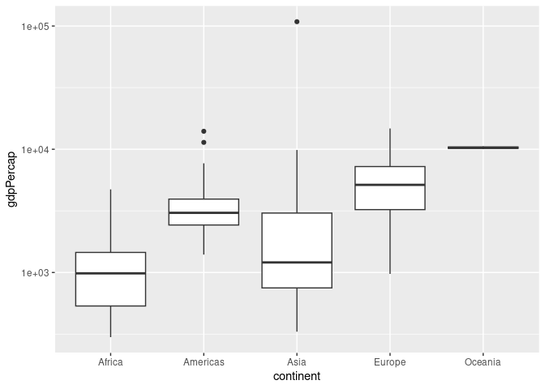
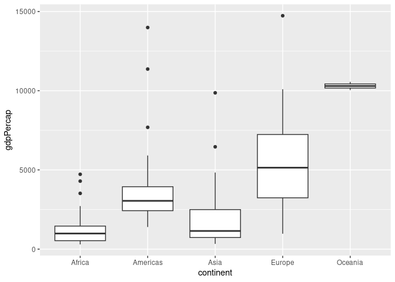
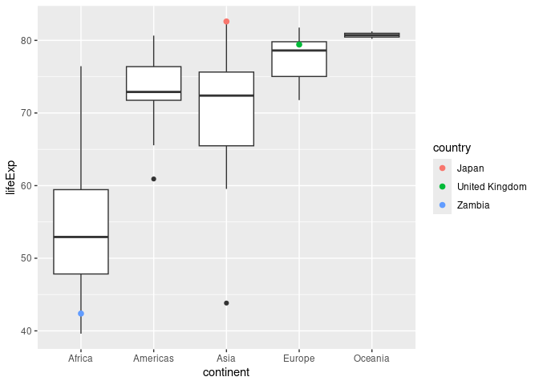
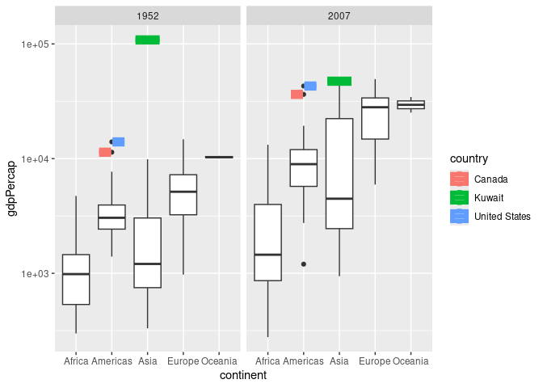
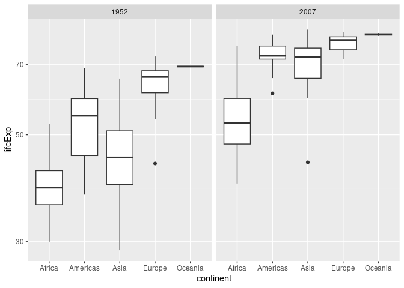
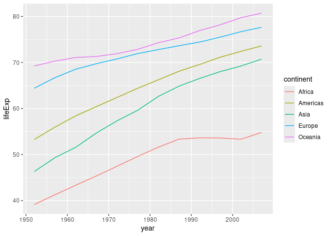
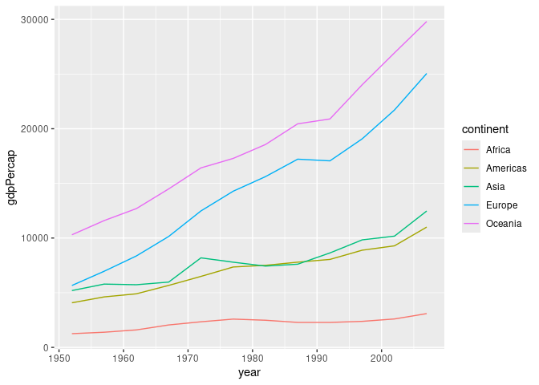
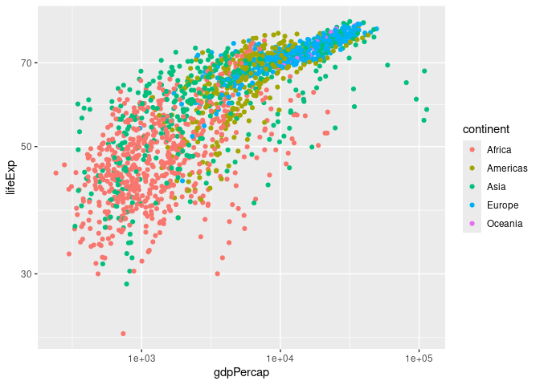
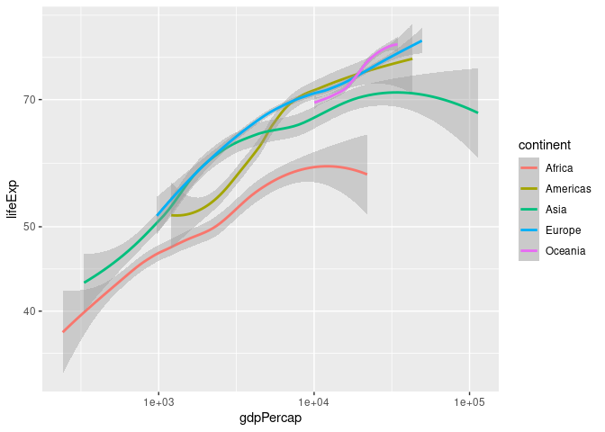

Gapminder
================
(Your name here)
2020-

- [Grading Rubric](#grading-rubric)
  - [Individual](#individual)
  - [Submission](#submission)
- [Guided EDA](#guided-eda)
  - [**q0** Perform your “first checks” on the dataset. What variables
    are in
    this](#q0-perform-your-first-checks-on-the-dataset-what-variables-are-in-this)
  - [**q1** Determine the most and least recent years in the `gapminder`
    dataset.](#q1-determine-the-most-and-least-recent-years-in-the-gapminder-dataset)
  - [**q2** Filter on years matching `year_min`, and make a plot of the
    GDP per capita against continent. Choose an appropriate `geom_` to
    visualize the data. What observations can you
    make?](#q2-filter-on-years-matching-year_min-and-make-a-plot-of-the-gdp-per-capita-against-continent-choose-an-appropriate-geom_-to-visualize-the-data-what-observations-can-you-make)
  - [**q3** You should have found *at least* three outliers in q2 (but
    possibly many more!). Identify those outliers (figure out which
    countries they
    are).](#q3-you-should-have-found-at-least-three-outliers-in-q2-but-possibly-many-more-identify-those-outliers-figure-out-which-countries-they-are)
  - [**q4** Create a plot similar to yours from q2 studying both
    `year_min` and `year_max`. Find a way to highlight the outliers from
    q3 on your plot *in a way that lets you identify which country is
    which*. Compare the patterns between `year_min` and
    `year_max`.](#q4-create-a-plot-similar-to-yours-from-q2-studying-both-year_min-and-year_max-find-a-way-to-highlight-the-outliers-from-q3-on-your-plot-in-a-way-that-lets-you-identify-which-country-is-which-compare-the-patterns-between-year_min-and-year_max)
- [Your Own EDA](#your-own-eda)
  - [**q5** Create *at least* three new figures below. With each figure,
    try to pose new questions about the
    data.](#q5-create-at-least-three-new-figures-below-with-each-figure-try-to-pose-new-questions-about-the-data)

*Purpose*: Learning to do EDA well takes practice! In this challenge
you’ll further practice EDA by first completing a guided exploration,
then by conducting your own investigation. This challenge will also give
you a chance to use the wide variety of visual tools we’ve been
learning.

<!-- include-rubric -->

# Grading Rubric

<!-- -------------------------------------------------- -->

Unlike exercises, **challenges will be graded**. The following rubrics
define how you will be graded, both on an individual and team basis.

## Individual

<!-- ------------------------- -->

| Category | Needs Improvement | Satisfactory |
|----|----|----|
| Effort | Some task **q**’s left unattempted | All task **q**’s attempted |
| Observed | Did not document observations, or observations incorrect | Documented correct observations based on analysis |
| Supported | Some observations not clearly supported by analysis | All observations clearly supported by analysis (table, graph, etc.) |
| Assessed | Observations include claims not supported by the data, or reflect a level of certainty not warranted by the data | Observations are appropriately qualified by the quality & relevance of the data and (in)conclusiveness of the support |
| Specified | Uses the phrase “more data are necessary” without clarification | Any statement that “more data are necessary” specifies which *specific* data are needed to answer what *specific* question |
| Code Styled | Violations of the [style guide](https://style.tidyverse.org/) hinder readability | Code sufficiently close to the [style guide](https://style.tidyverse.org/) |

## Submission

<!-- ------------------------- -->

Make sure to commit both the challenge report (`report.md` file) and
supporting files (`report_files/` folder) when you are done! Then submit
a link to Canvas. **Your Challenge submission is not complete without
all files uploaded to GitHub.**

``` r
library(tidyverse)
```

    ## ── Attaching core tidyverse packages ──────────────────────── tidyverse 2.0.0 ──
    ## ✔ dplyr     1.2.1     ✔ readr     2.2.0
    ## ✔ forcats   1.0.1     ✔ stringr   1.6.0
    ## ✔ ggplot2   4.0.3     ✔ tibble    3.3.1
    ## ✔ lubridate 1.9.5     ✔ tidyr     1.3.2
    ## ✔ purrr     1.2.2     
    ## ── Conflicts ────────────────────────────────────────── tidyverse_conflicts() ──
    ## ✖ dplyr::filter() masks stats::filter()
    ## ✖ dplyr::lag()    masks stats::lag()
    ## ℹ Use the conflicted package (<http://conflicted.r-lib.org/>) to force all conflicts to become errors

``` r
library(gapminder)
```

*Background*: [Gapminder](https://www.gapminder.org/about-gapminder/) is
an independent organization that seeks to educate people about the state
of the world. They seek to counteract the worldview constructed by a
hype-driven media cycle, and promote a “fact-based worldview” by
focusing on data. The dataset we’ll study in this challenge is from
Gapminder.

# Guided EDA

<!-- -------------------------------------------------- -->

First, we’ll go through a round of *guided EDA*. Try to pay attention to
the high-level process we’re going through—after this guided round
you’ll be responsible for doing another cycle of EDA on your own!

### **q0** Perform your “first checks” on the dataset. What variables are in this

dataset?

``` r
## TASK: Do your "first checks" here!
summary(gapminder)
```

    ##         country        continent        year         lifeExp     
    ##  Afghanistan:  12   Africa  :624   Min.   :1952   Min.   :23.60  
    ##  Albania    :  12   Americas:300   1st Qu.:1966   1st Qu.:48.20  
    ##  Algeria    :  12   Asia    :396   Median :1980   Median :60.71  
    ##  Angola     :  12   Europe  :360   Mean   :1980   Mean   :59.47  
    ##  Argentina  :  12   Oceania : 24   3rd Qu.:1993   3rd Qu.:70.85  
    ##  Australia  :  12                  Max.   :2007   Max.   :82.60  
    ##  (Other)    :1632                                                
    ##       pop              gdpPercap       
    ##  Min.   :6.001e+04   Min.   :   241.2  
    ##  1st Qu.:2.794e+06   1st Qu.:  1202.1  
    ##  Median :7.024e+06   Median :  3531.8  
    ##  Mean   :2.960e+07   Mean   :  7215.3  
    ##  3rd Qu.:1.959e+07   3rd Qu.:  9325.5  
    ##  Max.   :1.319e+09   Max.   :113523.1  
    ## 

**Observations**:

- Country, continent, year, life expectancy, population, gdp per capita

### **q1** Determine the most and least recent years in the `gapminder` dataset.

*Hint*: Use the `pull()` function to get a vector out of a tibble.
(Rather than the `$` notation of base R.)

``` r
## TASK: Find the largest and smallest values of `year` in `gapminder`
year_max <- gapminder %>%
  pull(year) %>%
  max()
year_min <- gapminder %>%
  pull(year) %>%
  min()

year_max
```

    ## [1] 2007

``` r
year_min
```

    ## [1] 1952

Use the following test to check your work.

``` r
## NOTE: No need to change this
assertthat::assert_that(year_max %% 7 == 5)
```

    ## [1] TRUE

``` r
assertthat::assert_that(year_max %% 3 == 0)
```

    ## [1] TRUE

``` r
assertthat::assert_that(year_min %% 7 == 6)
```

    ## [1] TRUE

``` r
assertthat::assert_that(year_min %% 3 == 2)
```

    ## [1] TRUE

``` r
if (is_tibble(year_max)) {
  print("year_max is a tibble; try using `pull()` to get a vector")
  assertthat::assert_that(False)
}

print("Nice!")
```

    ## [1] "Nice!"

### **q2** Filter on years matching `year_min`, and make a plot of the GDP per capita against continent. Choose an appropriate `geom_` to visualize the data. What observations can you make?

You may encounter difficulties in visualizing these data; if so document
your challenges and attempt to produce the most informative visual you
can.

``` r
## TASK: Create a visual of gdpPercap vs continent

gapminder %>%
  filter(year == year_min) %>%
  ggplot(aes(continent, gdpPercap)) +
  geom_boxplot() +
  scale_y_log10()
```

<!-- -->

``` r
gapminder %>%
  filter(year == year_min,
         gdpPercap < 90000) %>%
  ggplot(aes(continent, gdpPercap)) +
  geom_boxplot()
```

<!-- -->

**Observations**:

- In Asia there is a country with a much larger gdp per capita than the
  other countries (this point is there in the log plot (first one) but I
  removed it in the second one)
- The dataset has several large outliers but no small ones.
- Oceania has a much smaller interquartile range than the other
  continents. I would guess this is because there are fewer countries
  represented.
- Looking at the second plot (non log one), Europe has the largest
  variation in gdp per capita (in terms of range) if you exclude
  outliers. However, if you consider the outlier point that I removed
  from the Asia category, Asia has the largest variation if you include
  outliers.
- There are fewer outliers in the log plot vs the plot with the outlier
  point removed.

**Difficulties & Approaches**:

- When I first plotted the gdp per capita, there was a large outlier
  point in the Asia category that had a much higher gdp than the other
  countries represented. This was squishing all the other box plots down
  at the bottom because it made the scale so large on the y axis.
- I tried two things to address this. First I tried removing the outlier
  point by filtering out any points with a gdp per capita over 90,000,
  but then I figured that that data point was an actual country with
  abnormally high gdp per capita which is probably important, so it
  doesn’t really make sense to exclude it from the plot.
- Then I tried putting the points on a log scale, and that made the plot
  much more readable. I think the downside of this approach is that you
  have to remember it’s a log scale when you’re interpreting it, and
  that might make the interpretation a little more confusing.

### **q3** You should have found *at least* three outliers in q2 (but possibly many more!). Identify those outliers (figure out which countries they are).

``` r
## TASK: Identify the outliers from q2
gapminder %>%
  filter(year == year_min,
         (gdpPercap > 90000 & continent == "Asia") | (gdpPercap > 10000 & continent == "Americas"))
```

    ## # A tibble: 3 × 6
    ##   country       continent  year lifeExp       pop gdpPercap
    ##   <fct>         <fct>     <int>   <dbl>     <int>     <dbl>
    ## 1 Canada        Americas   1952    68.8  14785584    11367.
    ## 2 Kuwait        Asia       1952    55.6    160000   108382.
    ## 3 United States Americas   1952    68.4 157553000    13990.

**Observations**:

- Identify the outlier countries from q2
  - Canada, Kuwait, and the US (these are the three outliers from the
    log plot)

*Hint*: For the next task, it’s helpful to know a ggplot trick we’ll
learn in an upcoming exercise: You can use the `data` argument inside
any `geom_*` to modify the data that will be plotted *by that geom
only*. For instance, you can use this trick to filter a set of points to
label:

``` r
## NOTE: No need to edit, use ideas from this in q4 below
gapminder %>%
  filter(year == max(year)) %>%

  ggplot(aes(continent, lifeExp)) +
  geom_boxplot() +
  geom_point(
    data = . %>% filter(country %in% c("United Kingdom", "Japan", "Zambia")),
    mapping = aes(color = country),
    size = 2
  )
```

<!-- -->

### **q4** Create a plot similar to yours from q2 studying both `year_min` and `year_max`. Find a way to highlight the outliers from q3 on your plot *in a way that lets you identify which country is which*. Compare the patterns between `year_min` and `year_max`.

*Hint*: We’ve learned a lot of different ways to show multiple
variables; think about using different aesthetics or facets.

``` r
## TASK: Create a visual of gdpPercap vs continent
gapminder %>%
  filter(year == year_min | year == year_max) %>%
  ggplot(aes(continent, gdpPercap)) +
  geom_boxplot() +
  facet_wrap(~ year) +
  geom_boxplot(
    data = . %>% filter(country %in% c("Canada", "Kuwait", "United States")),
    mapping = aes(color = country),
    size = 2) +
  scale_fill_manual(values = "white") +
  scale_y_log10()
```

<!-- -->

**Observations**:

- Kuwait was the large outlier from Asia that I noticed earlier. In the
  2007 plot, it’s still on the high end for Asia but isn’t a huge
  outlier like in the 1952 data.
- Canada and the US remain outliers on the high end in both the 1952 and
  2007 data.
- The median gdp per capita has risen for all continents from 1952 to
  2007. 
- In the 2007 plot there is now a low outlier in the Americas. I wonder
  which country that is.
- It seems like there is a higher variation in gdp per capita among the
  countries within each continent in 2007 than in 1952. It’s a bit hard
  to tell because the log scale squishes the y axis as it goes up, so
  this could probably be better expressed with a plot showing some
  measure of variation in gdp per capita within each continent.

# Your Own EDA

<!-- -------------------------------------------------- -->

Now it’s your turn! We just went through guided EDA considering the GDP
per capita at two time points. You can continue looking at outliers,
consider different years, repeat the exercise with `lifeExp`, consider
the relationship between variables, or something else entirely.

### **q5** Create *at least* three new figures below. With each figure, try to pose new questions about the data.

``` r
## TASK: Your first graph
gapminder %>%
  filter(year == year_min | year == year_max) %>%
  ggplot(aes(continent, lifeExp)) +
  geom_boxplot() +
  facet_wrap(~ year) +
  scale_fill_manual(values = "white") +
  scale_y_log10()
```

<!-- -->

- While the median life expectancy for all continents goes up from 1952
  to 2007, the increase is particularly strong for Asia and the
  Americas. They go from being significantly behind Europe and Oceania
  in life expectancy to being close behind. Africa still lags behind in
  both cases.
- I don’t see this relative increase for Asia and the Americas in the
  gdp per capita from the previous plot I made. Instead, the relative
  shape of boxes from 1952 to 2007 is remarkably similar. I wonder if
  the relative increase for Asia and the Americas in life expectancy
  could be because the technology doesn’t exist to expand life
  expectancy past 75ish, so countries cap out around there and can’t go
  any higher, allowing countries with lower life expectancies to catch
  up.
- I wonder what this increase looks like over time for each of the
  continents, and also if any countries in particular are driving the
  increase.

``` r
## TASK: Your second graph
gapminder %>%
  group_by(continent, year) %>%
  mutate(lifeExp = mean(lifeExp)) %>%
  ungroup() %>%
  ggplot(aes(year, lifeExp, color = continent)) +
  geom_line()
```

<!-- -->

- This plot is the change in life expectancy over time for each
  continent. In 1952 the life expectancies of each continent are more
  spread out, while by 2007 Oceania, Europe, the Americas, and Asia are
  more bunched together (this is the same behavior that I noticed in the
  box plot)
- While all four of Oceania, Europe, the Americas, and Asia increase
  over this time period, the rate of increase (ie slope of the line) is
  higher for the Americas and Asia over this time.
- While Africa starts off increasing in life expectancy with the rest of
  the continents, it levels off around the late 1980s. I wonder what
  causes this? Why did Africa’s life expectancy mostly stop increasing?
- I wonder what this change looks like in terms of individual countries
  rather than averaged over whole continents.
- Interestingly none of these lines cross. The order of highest to
  lowest life expectancy by continent doesn’t change over the almost 60
  year period.

``` r
## TASK: Your third graph
gapminder %>%
  group_by(continent, year) %>%
  mutate(gdpPercap = mean(gdpPercap)) %>%
  ungroup() %>%
  ggplot(aes(year, gdpPercap, color = continent)) +
  geom_line()
```

<!-- -->

- This is gdp per capita over time for each continent. I see that all
  continents have increased in gdp per capita, but Oceania and Europe
  have had the steepest increase, followed by Asia and the Americas with
  a modest increase, and then Africa with only a slight increase over
  the time period.
- I think it is interesting that the life expectancies in Asia and the
  Americas have steeper increases than Oceania and Europe despite the
  gdps in Oceania and Europe increasing more quickly over the same time
  period. While this certainly doesn’t prove my hypothesis about life
  expectancy being capped in how much it can increase, I think this
  hypothesis could be an explanation for that.
- I assume there is a correlation between life expectancy and gdp per
  capita, but it would be useful to check that to better inform
  comparisons between these two plots.

``` r
gapminder %>%
  ggplot(aes(gdpPercap, lifeExp, color = continent)) +
  geom_point() + 
  scale_y_log10() +
  scale_x_log10()
```

<!-- -->

``` r
gapminder %>%
  ggplot(aes(gdpPercap, lifeExp, color = continent)) +
  scale_y_log10() +
  scale_x_log10() +
  geom_smooth()
```

    ## `geom_smooth()` using method = 'loess' and formula = 'y ~ x'

<!-- -->

- There appears to be a strong positive correlation between gdp per
  capita and life expectancy.

- I’m a little surprised - I was expecting life expectancy to level off
  at some point for Europe and Oceania as gdp increases but it doesn’t
  really. That might suggest that there is further room for life
  expectancy in those continents to increase as gdp increases.

- Life expectancy does appear to level off/decline slightly in Asia and
  Africa at the high end of their gdp per capita, but the error bars are
  the ends there are rather large, so I’m not super confident in that
  result.

- The lines in this plot are pretty curvy. I wonder if the different
  slopes correspond to periods of more or less growth in these
  continents, or what else might drive those. I’m not really sure how to
  investigate that, but it’s interesting.

- In the scatter plot, there are many more spread out points from Africa
  and Asia compared to Europe. I wonder what causes that? Maybe there’s
  more variety in gdp per capita and life expectancy between countries
  in Asia and Africa than in Europe.
