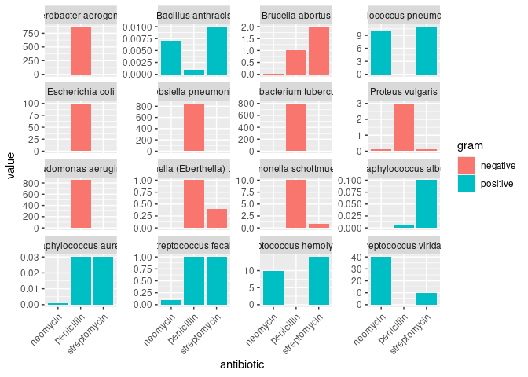
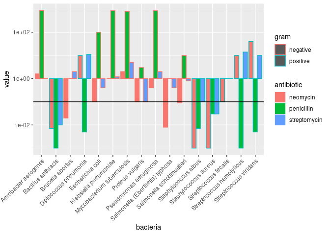
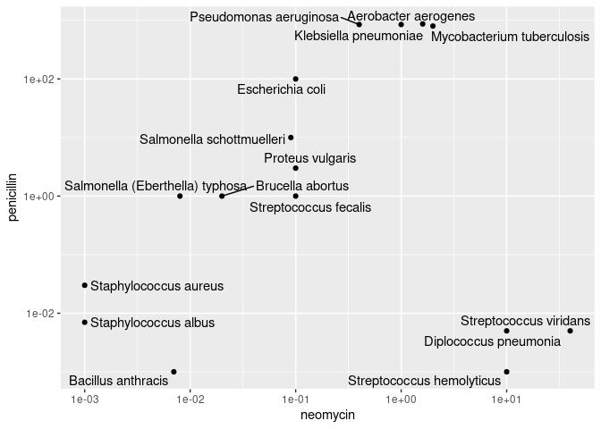
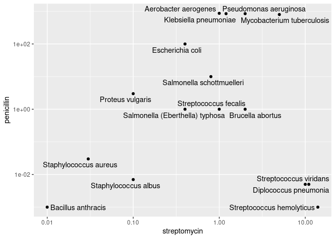
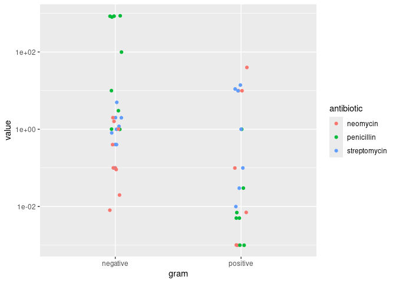
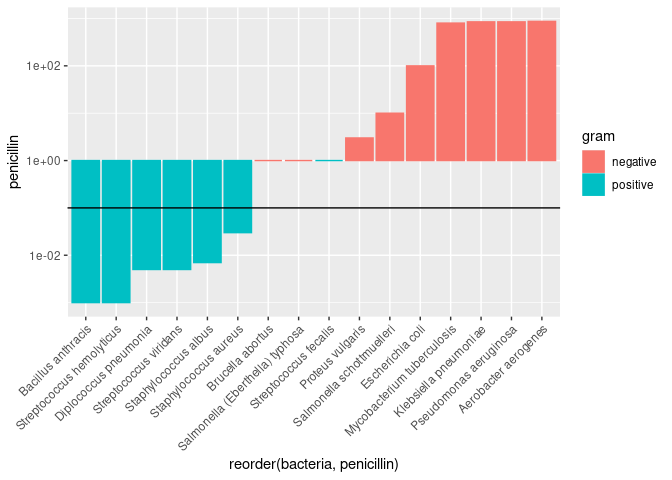

Antibiotics
================
(Your name here)
2020-

*Purpose*: Creating effective data visualizations is an *iterative*
process; very rarely will the first graph you make be the most
effective. The most effective thing you can do to be successful in this
iterative process is to *try multiple graphs* of the same data.

Furthermore, judging the effectiveness of a visual is completely
dependent on *the question you are trying to answer*. A visual that is
totally ineffective for one question may be perfect for answering a
different question.

In this challenge, you will practice *iterating* on data visualization,
and will anchor the *assessment* of your visuals using two different
questions.

*Note*: Please complete your initial visual design **alone**. Work on
both of your graphs alone, and save a version to your repo *before*
coming together with your team. This way you can all bring a diversity
of ideas to the table!

<!-- include-rubric -->

# Grading Rubric

<!-- -------------------------------------------------- -->

Unlike exercises, **challenges will be graded**. The following rubrics
define how you will be graded, both on an individual and team basis.

## Individual

<!-- ------------------------- -->

| Category | Needs Improvement | Satisfactory |
|----|----|----|
| Effort | Some task **q**’s left unattempted | All task **q**’s attempted |
| Observed | Did not document observations, or observations incorrect | Documented correct observations based on analysis |
| Supported | Some observations not clearly supported by analysis | All observations clearly supported by analysis (table, graph, etc.) |
| Assessed | Observations include claims not supported by the data, or reflect a level of certainty not warranted by the data | Observations are appropriately qualified by the quality & relevance of the data and (in)conclusiveness of the support |
| Specified | Uses the phrase “more data are necessary” without clarification | Any statement that “more data are necessary” specifies which *specific* data are needed to answer what *specific* question |
| Code Styled | Violations of the [style guide](https://style.tidyverse.org/) hinder readability | Code sufficiently close to the [style guide](https://style.tidyverse.org/) |

## Submission

<!-- ------------------------- -->

Make sure to commit both the challenge report (`report.md` file) and
supporting files (`report_files/` folder) when you are done! Then submit
a link to Canvas. **Your Challenge submission is not complete without
all files uploaded to GitHub.**

``` r
library(tidyverse)
```

    ## ── Attaching core tidyverse packages ──────────────────────── tidyverse 2.0.0 ──
    ## ✔ dplyr     1.2.1     ✔ readr     2.2.0
    ## ✔ forcats   1.0.1     ✔ stringr   1.6.0
    ## ✔ ggplot2   4.0.3     ✔ tibble    3.3.1
    ## ✔ lubridate 1.9.5     ✔ tidyr     1.3.2
    ## ✔ purrr     1.2.2     
    ## ── Conflicts ────────────────────────────────────────── tidyverse_conflicts() ──
    ## ✖ dplyr::filter() masks stats::filter()
    ## ✖ dplyr::lag()    masks stats::lag()
    ## ℹ Use the conflicted package (<http://conflicted.r-lib.org/>) to force all conflicts to become errors

``` r
library(ggrepel)
```

*Background*: The data\[1\] we study in this challenge report the
[*minimum inhibitory
concentration*](https://en.wikipedia.org/wiki/Minimum_inhibitory_concentration)
(MIC) of three drugs for different bacteria. The smaller the MIC for a
given drug and bacteria pair, the more practical the drug is for
treating that particular bacteria. An MIC value of *at most* 0.1 is
considered necessary for treating human patients.

These data report MIC values for three antibiotics—penicillin,
streptomycin, and neomycin—on 16 bacteria. Bacteria are categorized into
a genus based on a number of features, including their resistance to
antibiotics.

``` r
## NOTE: If you extracted all challenges to the same location,
## you shouldn't have to change this filename
filename <- "./data/antibiotics.csv"

## Load the data
df_antibiotics <- read_csv(filename)
```

    ## Rows: 16 Columns: 5
    ## ── Column specification ────────────────────────────────────────────────────────
    ## Delimiter: ","
    ## chr (2): bacteria, gram
    ## dbl (3): penicillin, streptomycin, neomycin
    ## 
    ## ℹ Use `spec()` to retrieve the full column specification for this data.
    ## ℹ Specify the column types or set `show_col_types = FALSE` to quiet this message.

``` r
df_antibiotics %>% knitr::kable()
```

| bacteria                        | penicillin | streptomycin | neomycin | gram     |
|:--------------------------------|-----------:|-------------:|---------:|:---------|
| Aerobacter aerogenes            |    870.000 |         1.00 |    1.600 | negative |
| Brucella abortus                |      1.000 |         2.00 |    0.020 | negative |
| Bacillus anthracis              |      0.001 |         0.01 |    0.007 | positive |
| Diplococcus pneumonia           |      0.005 |        11.00 |   10.000 | positive |
| Escherichia coli                |    100.000 |         0.40 |    0.100 | negative |
| Klebsiella pneumoniae           |    850.000 |         1.20 |    1.000 | negative |
| Mycobacterium tuberculosis      |    800.000 |         5.00 |    2.000 | negative |
| Proteus vulgaris                |      3.000 |         0.10 |    0.100 | negative |
| Pseudomonas aeruginosa          |    850.000 |         2.00 |    0.400 | negative |
| Salmonella (Eberthella) typhosa |      1.000 |         0.40 |    0.008 | negative |
| Salmonella schottmuelleri       |     10.000 |         0.80 |    0.090 | negative |
| Staphylococcus albus            |      0.007 |         0.10 |    0.001 | positive |
| Staphylococcus aureus           |      0.030 |         0.03 |    0.001 | positive |
| Streptococcus fecalis           |      1.000 |         1.00 |    0.100 | positive |
| Streptococcus hemolyticus       |      0.001 |        14.00 |   10.000 | positive |
| Streptococcus viridans          |      0.005 |        10.00 |   40.000 | positive |

# Visualization

<!-- -------------------------------------------------- -->

### **q1** Prototype 5 visuals

To start, construct **5 qualitatively different visualizations of the
data** `df_antibiotics`. These **cannot** be simple variations on the
same graph; for instance, if two of your visuals could be made identical
by calling `coord_flip()`, then these are *not* qualitatively different.

For all five of the visuals, you must show information on *all 16
bacteria*. For the first two visuals, you must *show all variables*.

*Hint 1*: Try working quickly on this part; come up with a bunch of
ideas, and don’t fixate on any one idea for too long. You will have a
chance to refine later in this challenge.

*Hint 2*: The data `df_antibiotics` are in a *wide* format; it may be
helpful to `pivot_longer()` the data to make certain visuals easier to
construct.

#### Visual 1 (All variables)

In this visual you must show *all three* effectiveness values for *all
16 bacteria*. This means **it must be possible to identify each of the
16 bacteria by name.** You must also show whether or not each bacterium
is Gram positive or negative.

``` r
# WRITE YOUR CODE HERE

df_antibiotics %>%
  pivot_longer(
    cols = c(penicillin, streptomycin, neomycin),
    names_to = "antibiotic",
    values_to = "value"
  ) %>%
  ggplot(aes(x = antibiotic, y = value, fill = gram)) +
  geom_col() +
  facet_wrap(vars(bacteria), scales = "free_y") +
  theme(
    axis.text.x = element_text(
      angle = 45,
      hjust = 1
    )
  )
```

<!-- -->

#### Visual 2 (All variables)

In this visual you must show *all three* effectiveness values for *all
16 bacteria*. This means **it must be possible to identify each of the
16 bacteria by name.** You must also show whether or not each bacterium
is Gram positive or negative.

Note that your visual must be *qualitatively different* from *all* of
your other visuals.

``` r
# WRITE YOUR CODE HERE

df_antibiotics %>%
  pivot_longer(
    cols = c(penicillin, streptomycin, neomycin),
    names_to = "antibiotic",
    values_to = "value"
  ) %>%
  ggplot(aes(x = bacteria, y = value, fill = antibiotic, color = gram)) +
  geom_col(position = "dodge") +
  theme(
    axis.text.x = element_text(
      angle = 45,
      hjust = 1
    )
  ) +
  scale_y_log10() +
  geom_hline(yintercept = 0.1)
```

<!-- -->

#### Visual 3 (Some variables)

In this visual you may show a *subset* of the variables (`penicillin`,
`streptomycin`, `neomycin`, `gram`), but you must still show *all 16
bacteria*.

Note that your visual must be *qualitatively different* from *all* of
your other visuals.

``` r
# WRITE YOUR CODE HERE
library(ggrepel)

df_antibiotics %>%
  ggplot(aes(x = neomycin, y = penicillin)) +
  geom_point() +
  geom_text_repel(aes(label = bacteria)) +
  scale_y_log10() +
  scale_x_log10()
```

<!-- -->

``` r
df_antibiotics %>%
  ggplot(aes(x = streptomycin, y = penicillin)) +
  geom_point() +
  geom_text_repel(aes(label = bacteria)) +
  scale_y_log10() +
  scale_x_log10()
```

<!-- -->

#### Visual 4 (Some variables)

In this visual you may show a *subset* of the variables (`penicillin`,
`streptomycin`, `neomycin`, `gram`), but you must still show *all 16
bacteria*.

Note that your visual must be *qualitatively different* from *all* of
your other visuals.

``` r
# WRITE YOUR CODE HERE
df_antibiotics %>%
  pivot_longer(
    cols = c(penicillin, streptomycin, neomycin),
    names_to = "antibiotic",
    values_to = "value") %>%
  ggplot(aes(x = gram, y = value, color = antibiotic)) +
  geom_jitter(width = 0.05) +
  scale_y_log10()
```

<!-- -->

#### Visual 5 (Some variables)

In this visual you may show a *subset* of the variables (`penicillin`,
`streptomycin`, `neomycin`, `gram`), but you must still show *all 16
bacteria*.

Note that your visual must be *qualitatively different* from *all* of
your other visuals.

``` r
# WRITE YOUR CODE HERE
df_antibiotics %>%
  ggplot(aes(x = reorder(bacteria, penicillin), y = penicillin, fill = gram, color = gram)) +
  geom_col() +
  theme(
    axis.text.x = element_text(
      angle = 45,
      hjust = 1
    )
  ) +
  scale_y_log10() +
  geom_hline(yintercept = 0.1)
```

<!-- -->

### **q2** Assess your visuals

There are **two questions** below; use your five visuals to help answer
both Guiding Questions. Note that you must also identify which of your
five visuals were most helpful in answering the questions.

*Hint 1*: It’s possible that *none* of your visuals is effective in
answering the questions below. You may need to revise one or more of
your visuals to answer the questions below!

*Hint 2*: It’s **highly unlikely** that the same visual is the most
effective at helping answer both guiding questions. **Use this as an
opportunity to think about why this is.**

#### Guiding Question 1

> How do the three antibiotics vary in their effectiveness against
> bacteria of different genera and Gram stain?

*Observations* - What is your response to the question above?

- From visual 4, I can see that penicillin has lower MIC values for gram
  positive bacteria than gram negative bacteria, indicating it is more
  effective against the gram positive bacteria. It makes sense that gram
  would affect penicillin’s effectiveness since a bacteria’s gram has to
  do with its cell wall thickness, and penicillin targets cell walls.

- For neomycin and streptomycin, there does not seem to be a
  relationship between the gram of the bacteria and the antibiotic’s
  effectiveness against it.

- From visual 3, neomycin appears to be especially effective against the
  stapylococcus genus and ineffective against streptococcus. Penicillin
  is especially effective against stapylococcus and streptococcus (and
  bacillus potentially, but there is only one data point for that
  genus), and it is ineffective against several different genii.
  Streptomycin is effective against bacillus (again just one data point)
  and ineffective against streptococcus.

Which of your visuals above (1 through 5) is **most effective** at
helping to answer this question? Why?

- For looking at gram, visual 4 was most effective because it
  specifically focuses on the gram and eliminates other information,
  making it easier to see the effects that gram has on the MIC value.
  However, it does not say anything about the genera of the bacteria.
- For looking at the effectiveness of the antibiotics against different
  genera, visual 3 was the most effective because I could clearly see
  which bacteria species ended up grouped together because they had
  similar MIC values, and by looking at their names I could see which
  ones came from the same genus. What I think would have been even more
  effective for this would be to have three single axis scales (like a
  number line) that each have each species of bacteria marked by their
  MIC value. It got a little confusing having the two scales but only
  trying to look at one dimension at a time.
- Even though visuals 1 and 2 showed all of the information at once in
  just one graph, it was easier to answer this question by looking at
  two separate graphs.

#### Guiding Question 2

In 1974 *Diplococcus pneumoniae* was renamed *Streptococcus pneumoniae*,
and in 1984 *Streptococcus fecalis* was renamed *Enterococcus fecalis*
\[2\].

> Why was *Diplococcus pneumoniae* was renamed *Streptococcus
> pneumoniae*?

*Observations* - What is your response to the question above?

- From visual 3, I can see that *Diplococcus pneumoniae* is grouped
  together with streptococcus viridans and streptococcus hemolyticus in
  both charts (the penicillin vs streptomycin and penicillin vs
  neomycin), indicating that these three bacteria species have similar
  MIC values for each antibiotic.

- Just because they have similar MIC values doesn’t mean the should
  necessarily be classified as the same species since these bacteria
  could have other features that are different from each other, or maybe
  they’re not genetically related and just have similar features.
  However, the fact that they do share traits is a compelling reason to
  dig further into why they are similar.

Which of your visuals above (1 through 5) is **most effective** at
helping to answer this question? Why?

- Visual 3 is the most effective because it groups the bacteria species
  together based on whether they have similar MIC values, which makes it
  really easy to find patterns in their names because they are grouped
  already. What might be more effective would be coloring the points on
  the graph by genus to make it easier to see.

# References

<!-- -------------------------------------------------- -->

\[1\] Neomycin in skin infections: A new topical antibiotic with wide
antibacterial range and rarely sensitizing. Scope. 1951;3(5):4-7.

\[2\] Wainer and Lysen, “That’s Funny…” *American Scientist* (2009)
[link](https://www.americanscientist.org/article/thats-funny)
